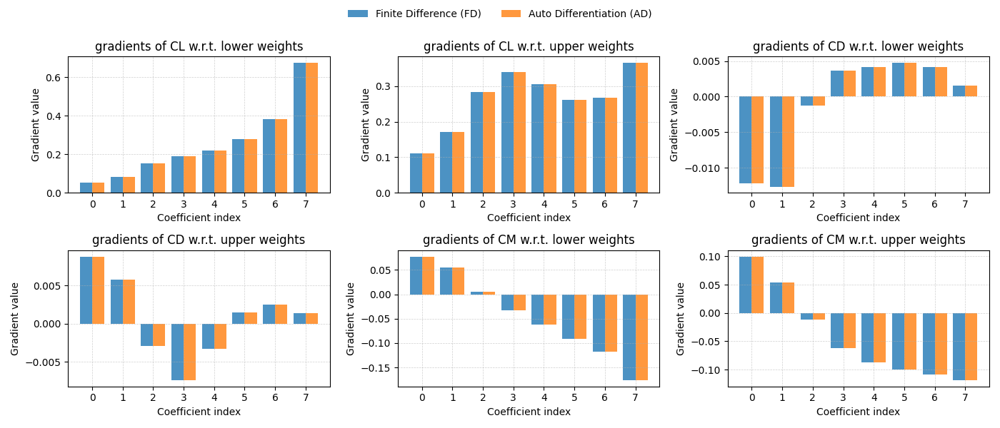
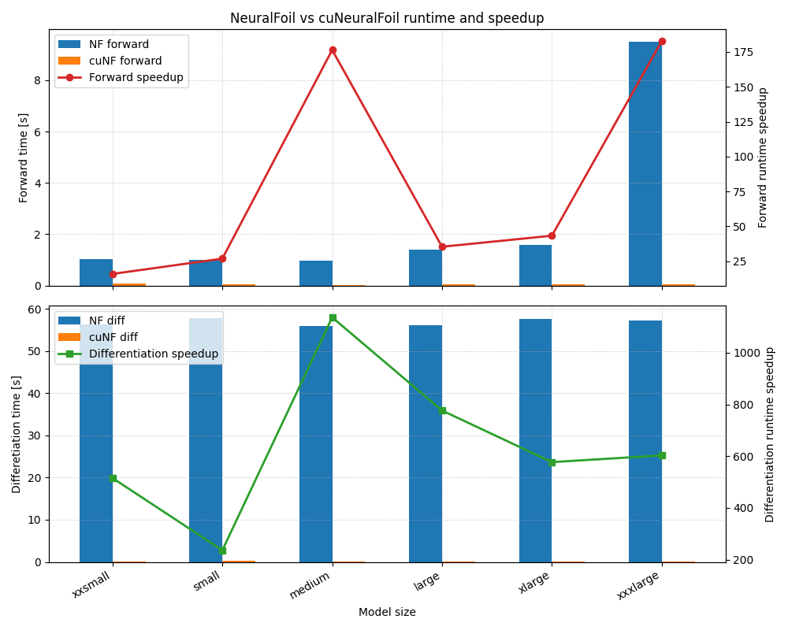

# cuNeuralFoil

cuNeuralFoil is a **PyTorch/CUDA-accelerated** wrapper around [NeuralFoil](https://github.com/peterdsharpe/NeuralFoil), providing:

- GPU-accelerated evaluation of NeuralFoil models
- **Native auto-differentiation support** via PyTorch (`torch.autograd`)
- Batched inference for fast evaluation of many airfoils / operating points

It is intended as a drop-in complement to the original NeuralFoil for use in **gradient-based design, optimization and research** workflows.

---

## 1. Installation

After cloning the repository:

```bash
cd cuNeuralFoil
pip install -e .
```

Once installed, you can import it as:

```python
import cuneuralfoil
from cuneuralfoil.cu_kulfan_airfoil import cuKulfanAirfoil
from cuneuralfoil.main import get_aero_from_airfoil_cuda, get_aero_from_kulfan_parameters_cuda

```

## 2. Usage Example

All examples below assume you have:

```python
import torch
import neuralfoil as nf
import aerosandbox as asb
import numpy as np

from cuneuralfoil.cu_kulfan_airfoil import cuKulfanAirfoil
from cuneuralfoil.main import get_aero_from_airfoil_cuda, get_aero_from_kulfan_parameters_cuda
```

and a NVIDIA GPU device:
```python
device = 'cuda' # or 'cpu'
```

### 2.1 Predict aerodynamic performance from an AeroSandbox airfoil

Start from an ```aerosandbox.Airfoil```, convert it to a Kulfan representation, and evaluate on GPU:

```python
airfoil_asb = asb.Airfoil("naca4412").to_kulfan_airfoil()

aero = get_aero_from_airfoil_cuda(
    airfoil=airfoil_asb,
    alpha=3.0,
    Re=5e6,
    device=device,
    model_size="xlarge",  # or "small", "medium", etc.
)

print("CL:", aero["CL"].item())
print("CD:", aero["CD"].item())
print("CM:", aero["CM"].item())
```

### 2.2 Predict from Kulfan/CST
Wrap a ```KulfanAirfoil``` in ```cuKulfanAirfoil``` to get CUDA tensors with ```requires_grad=True```:
```python
# Start from an AeroSandbox KulfanAirfoil
airfoil_asb = asb.Airfoil("naca4412").to_kulfan_airfoil()

# Wrap into cuKulfanAirfoil (moves Kulfan params to GPU)
airfoil = cuKulfanAirfoil(
    airfoil_asb,
    requires_grad=True,
    device=device,
)

alpha = torch.tensor(3.0, dtype=torch.float32, device=device, requires_grad=True)
Re = torch.tensor(5e6, dtype=torch.float32, device=device, requires_grad=True)

aero = get_aero_from_kulfan_parameters_cuda(
    airfoil.kulfan_parameters_cuda,
    alpha,
    Re,
    device=device,
    model_size="xlarge",
)

print("CL:", aero["CL"].item())
print("CD:", aero["CD"].item())
print("CM:", aero["CM"].item())
```

### 2.3 Batched predictions

Here let's copy the same airfoil for ```B``` times and run the model in a single batched forward pass:

```python
B = 1024
model_size = "xlarge"

airfoil = cuKulfanAirfoil(
    airfoil_asb,
    requires_grad=True,
    device=device,
)

# Geometry batch: repeat same airfoil B times
upper_batch = airfoil.upper_weights_cuda.unsqueeze(0).repeat(B, 1)
lower_batch = airfoil.lower_weights_cuda.unsqueeze(0).repeat(B, 1)
LE_batch    = airfoil.leading_edge_weight_cuda.repeat(B)
TE_batch    = airfoil.TE_thickness_cuda.repeat(B)

kulfan_batch = {
    "upper_weights_cuda": upper_batch,
    "lower_weights_cuda": lower_batch,
    "leading_edge_weight_cuda": LE_batch,
    "TE_thickness_cuda": TE_batch,
}

# Flow parameters batch
alpha_batch = torch.full(
    (B,), 3.0,
    dtype=torch.float32, device=device, requires_grad=True,
)
Re_batch = torch.full(
    (B,), 5e6,
    dtype=torch.float32, device=device, requires_grad=True,
)

aero = get_aero_from_kulfan_parameters_cuda(
    kulfan_batch,
    alpha_batch,
    Re_batch,
    device=device,
    model_size=model_size,
)

print("CL batch shape:", aero["CL"].shape)  # (B,)

```

### 2.4 Direct auto-differentiation via PyTorch

Gradients can be computed by directly calling ```torch.autograd.grad``` on the outputs:

```python
# Forward pass
aero = get_aero_from_kulfan_parameters_cuda(
    kulfan_batch,
    alpha_batch,
    Re_batch,
    device=device,
    model_size=model_size,
)

ones = torch.ones_like(aero["CL"]) # ones for grad_outputs (same shape as CL: (B,))
AD_dCL_dlower = torch.autograd.grad(
    aero["CL"], lower_batch,
    grad_outputs=ones,
    retain_graph=True,
)[0]
AD_dCL_dupper = torch.autograd.grad(
    aero["CL"], upper_batch,
    grad_outputs=ones,
    retain_graph=True,
)[0]
AD_dCL_dalpha = torch.autograd.grad(
    aero["CL"], alpha_batch,
    grad_outputs=ones,
    retain_graph=True,
)[0]
AD_dCL_dRe = torch.autograd.grad(
    aero["CL"], Re_batch,
    grad_outputs=ones,
    retain_graph=True,
)[0]

print("dCL/dlower shape:", AD_dCL_dlower.shape)  # (B, 8)
print("dCL/dalpha shape:", AD_dCL_dalpha.shape)  # (B,)
print("dCL/dalpha:", AD_dCL_dalpha)

```

This makes cuNeuralFoil suitable for gradient-based inverse design, optimization and differentiable pipelines.

## 3. Consistency with NeuralFoil
cuNeuralFoil is designed to be numerically consistent with the original NeuralFoil implementation.

We validate:

 - Scalars: CL, CD, CM, transition locations (Top_Xtr, Bot_Xtr), etc.

 - Gradients: Finite-difference vs auto-diff comparisons of sensitivities w.r.t. Kulfan/CST coefficients, angle of attack, and Reynolds number.
 
 An example gradient comparison figure (finite-difference vs auto-diff for aerodynamic coefficients w.r.t. upper/lower Kulfan weights) looks like:
 

 
 You can run ```test.py``` to get more results.
 
 ## 4. Computational Efficiency & Speedup
 
cuNeuralFoil exploits GPU parallelism and batched evaluation to accelerate:

 - Forward evaluation (CL, CD, CM, BL metrics, etc.)

 - Differentiation (via torch.autograd) for large batches of airfoils or operating points
 
 We benchmark multiple NeuralFoil model sizes also in ```test.py```:
 
 ``` 
 ["xxsmall", "small", "medium", "large", "xlarge", "xxxlarge"]
 ```
 
 For each model, we measure:
 
  - ```time_nf_forward```: original NeuralFoil forward time (CPU)
  
  - ```time_nf_diff```: original NeuralFoil finite-difference differentiation time

  - ```time_cunf_forward```: cuNeuralFoil forward time (CUDA)

  - ```time_cunf_diff```: cuNeuralFoil auto differentiation time

  - ```forward_speedup = time_nf_forward / time_cunf_forward```: forward prediction speedup

  - ```diff_speedup = time_nf_diff / time_cunf_diff```: differentiation speedup
  
 An example timing and speedup figure:
 
 
 ---
 ## 5. Acknowledgements
cuNeuralFoil builds upon and extends NeuralFoil by Peter Sharpe. Portions of the code are adapted from NeuralFoil, which is licensed under the MIT License.